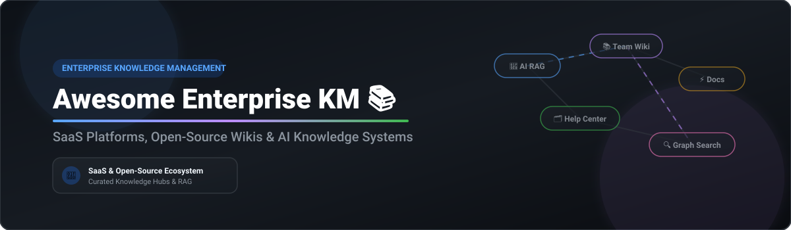

# 📚 Awesome Enterprise Knowledge Management

  

  
  
  
  
  

## 🌐 Top Enterprise Knowledge Management Platforms Ecosystem

**Curated List of SaaS Products & Open-Source GitHub Projects**  
*Focused on Internal Knowledge Bases, Team Wikis, AI RAG Documentation & Self-Service Support*  
**Last updated: September 2026**

---

### 🔍 Search Engine Optimization (SEO) & Key Market Summary
Enterprise Knowledge Management (KM) software empowers engineering teams, technical writers, customer support representatives, and cross-functional organizations to capture, verify, and retrieve critical institutional knowledge. Whether building internal wikis, self-service support portals, or AI Retrieval-Augmented Generation (RAG) knowledge graphs, choosing the right platform impacts productivity, onboarding efficiency, and data privacy.

---

## 📌 Table of Contents
- [🏢 SaaS/Hosted Platforms](#-saashosted-platforms)
- [🔓 Open-Source GitHub Projects](#-open-source-github-projects)
- [🛠️ How to Contribute](#%EF%B8%8F-how-to-contribute)
- [❤️ Support & Sponsorship](#%EF%B8%8F-support--sponsorship)
- [📈 Star History](#-star-history)
- [⚠️ Disclaimer](#%EF%B8%8F-disclaimer)

---

## 🏢 SaaS/Hosted Platforms

The global Enterprise Knowledge Management market is estimated at **~$8.5 Billion to $12 Billion** (growing at a 16-19% CAGR towards 2030). The sector is **moderately fragmented**: anchored by massive market leaders like Atlassian (Confluence) and Zendesk in enterprise suites, alongside specialized mid-market leaders (Guru, Document360, Slab) and fast-emerging AI-native RAG startups. It is not a strict "winner-take-all" market due to diverse workflow, compliance, and custom integration needs.

Below is a curated comparison of leading SaaS Enterprise Knowledge Base & Wiki platforms, sorted by estimated company size / valuation (descending):

| Product 🚀 | Description 📝 | Valuation / Size 💰 | Starting Pricing 🏷️ | Free Tier Limits 🎁 |
| :--- | :--- | :--- | :--- | :--- |
| **[Confluence](https://www.atlassian.com/software/confluence)** | Atlassian's enterprise wiki and doc platform deeply integrated with Jira & DevOps ecosystems. | **~$45 Billion** *(Market Cap)* | **$6.05 / user / month** *(Standard plan)* | **Free for up to 10 users** *(2 GB storage, community support)* |
| **[Zendesk Guide](https://www.zendesk.com/)** | Enterprise help centers, internal knowledge bases, and AI ticketing integration. | **~$10.2 Billion** *(Private equity valuation)* | **$19 / agent / month** *(Suite Team)* | **14-day free trial** *(Full access to Suite features, no credit card required)* |
| **[Bloomfire](https://bloomfire.com/)** | Knowledge engagement & Q&A platform focused on enterprise sharing and employee onboarding. | **~$150 Million - $250 Million** *(Private / PE backed)* | **$25 / user / month** *(Basic tier)* | **30-day free trial** *(Access to core knowledge sharing features)* |
| **[Guru](https://www.getguru.com/)** | AI-powered knowledge layer delivering verified answers in Slack, browsers, and workflows. | **~$70 Million** *(Total VC Raised)* | **$15 / user / month** *(All-in-one AI plan)* | **30-day free trial** *(Unlimited features for up to 30 users)* |
| **[Document360](https://document360.com/)** | Knowledge base software for public help centers & internal technical documentation. | **~$50 Million - $100 Million** *(Bootstrapped ARR scale)* | **$149 / project / month** *(Standard tier, 3 team accounts)* | **14-day free trial** *(5 team accounts, full features access)* |
| **[Slab](https://slab.com/)** | Modern knowledge base platform with unified search and stale document verification workflows. | **~$20 Million - $50 Million** *(Backed by Matrix Partners)* | **$6.67 / user / month** *(Startup plan)* | **Free for up to 10 users** *(10 MB attachment limit per file)* |
| **[Helpjuice](https://helpjuice.com/)** | Customizable knowledge base software with rich text editor, AI search, and analytics. | **~$15 Million - $30 Million** *(Bootstrapped)* | **$120 / month** *(Starter plan up to 4 users)* | **14-day free trial** *(Full functional access, no credit card required)* |
| **[KnowledgeOwl](https://www.knowledgeowl.com/)** | Customer-centric knowledge base software offering public & private doc customization. | **~$10 Million - $20 Million** *(Independent)* | **$79 / month** *(Solo author plan, 1 knowledge base)* | **30-day free trial** *(Full feature access with sample data)* |
| **[Tettra](https://tettra.com/)** | Lightweight internal wiki capturing tribal knowledge directly within Slack & MS Teams. | **~$10 Million - $20 Million** *(Bootstrapped / Seed)* | **$4 / user / month** *(Basic plan)* | **Free for up to 10 users** *(Up to 50 docs limit)* |
| **[Panviva](https://panviva.com/)** | Guided process execution & step-by-step workflow guidance for regulated enterprise agents. | **~$10 Million - $20 Million** *(Acquired by Workgrid)* | **$15 / user / month** *(Guided workflow tier)* | **14-day free trial** *(Guided process sandbox test drive)* |

---

## 🔓 Open-Source GitHub Projects

Open-source knowledge management systems provide full data ownership, privacy compliance (GDPR/HIPAA), self-hosting capability, and zero per-seat licensing fees.

Below is the list of top active open-source projects, sorted by GitHub Star count (descending):

- **[AppFlowy](https://github.com/AppFlowy-IO/AppFlowy)**   
  *Open-source Notion alternative built with Flutter and Rust. Local-first architecture with offline support, kanban boards, databases, and AI integration. License: AGPL-3.0.*

- **[Outline](https://github.com/outline/outline)**   
  *Fast, collaborative knowledge base for teams with a polished Notion-like editor. Features real-time collaboration, nested collections, Slack integration, and AI-powered search. License: BSL 1.1.*

- **[Logseq](https://github.com/logseq/logseq)**   
  *Privacy-first, open-source knowledge graph and outliner for personal & team knowledge management. Stores data locally in plain Markdown/Org-mode files. License: AGPL-3.0.*

- **[Trilium Notes](https://github.com/TriliumNext/Notes)**   
  *Hierarchical personal & team knowledge base with rich JS scripting, REST API automation, and note mapping. Community maintained fork. License: AGPL-3.0.*

- **[Wiki.js](https://github.com/requarks/wiki)**   
  *Modern, extensible Node.js wiki engine with Markdown editing, multi-database support, enterprise auth (OAuth/SAML), and optional Git-backed sync. License: AGPL-3.0.*

- **[Docmost](https://github.com/docmost/docmost)**   
  *Open-source Confluence and Notion alternative. Features real-time collaborative editing (CRDT), nested page spaces, granular RBAC, and native diagrams (Draw.io, Mermaid). License: AGPL-3.0.*

- **[BookStack](https://github.com/BookStackApp/BookStack)**   
  *Opinionated, simple documentation platform organized into Shelves → Books → Chapters → Pages. WYSIWYG & Markdown editors with built-in RBAC. License: MIT.*

- **[Anytype](https://github.com/anyproto/anytype-ts)**   
  *Local-first, peer-to-peer encrypted workspace for notes, tasks, and knowledge graphs. Built for secure data ownership. License: Any Source Available License 1.0.*

- **[Docusaurus](https://github.com/facebook/docusaurus)**   
  *Meta's open-source static site generator optimized for building high-performance technical documentation and knowledge sites using React and Markdown. License: MIT.*

- **[Discourse](https://github.com/discourse/discourse)**   
  *Open-source community discussion forum platform widely utilized for internal team Q&A, knowledge sharing, and enterprise support. License: GPL-2.0.*

- **[DokuWiki](https://github.com/dokuwiki/dokuwiki)**   
  *Standards-compliant, simple-to-use plain text wiki requiring no SQL database. Features clean syntax, versioning, and thousands of plugins. License: GPL-2.0.*

- **[MediaWiki](https://github.com/wikimedia/mediawiki)**   
  *The scale-proven wiki engine behind Wikipedia. Ideal for extremely large, highly interlinked organizational knowledge repositories. License: GPL-2.0.*

- **[Answer](https://github.com/apache/answer)**   
  *Apache-incubated open-source Q&A community platform for enterprise teams, serving as a self-hosted Stack Overflow alternative. License: Apache-2.0.*

- **[Notesnook](https://github.com/streetwriters/notesnook)**   
  *Fully open-source, zero-knowledge end-to-end encrypted note-taking application for sensitive internal knowledge management. License: GPL-3.0.*

- **[WeKnora](https://github.com/Tencent/WeKnora)**   
  *LLM-powered enterprise knowledge framework by Tencent. Transforms raw documents into queryable RAG and auto-generated knowledge graph Wikis. License: MIT.*

- **[Documize](https://github.com/documize/community)**   
  *Enterprise documentation platform built with Go and EmberJS for managing internal & external technical docs. License: AGPL-3.0.*

- **[FreeScout](https://github.com/freescout-helpdesk/freescout)**   
  *Lightweight open-source helpdesk & shared inbox with built-in knowledge base modules. License: AGPL-3.0.*

- **[PandaWiki](https://github.com/chaitin/PandaWiki)**   
  *LLM-driven intelligent knowledge base system developed by Chaitin for multi-source document ingestion and RAG retrieval. License: Open Source.*

---

### 💡 Recommended Architecture Blueprints
To build a production-grade self-hosted enterprise knowledge stack:
1. **Core Wiki & Documentation Layer**: Combine **Outline** or **Docmost** for real-time collaboration.
2. **AI RAG & Intelligence Layer**: Integrate **WeKnora** or **PandaWiki** with a local LLM runner (**Ollama**).
3. **Structured Technical Docs**: Deploy **BookStack** or **Docusaurus**.
4. **Data Persistence**: Back up with **PostgreSQL + Redis + S3-compatible storage**.

---

## 🛠️ How to Contribute

Contributions are welcome! Please follow these simple guidelines:
1. Fork this repository.
2. Edit `README.md` to add/update entries (maintain table/list formatting).
3. Ensure accurate details regarding pricing, star counts, and licenses.
4. Submit a Pull Request (PR) with a brief summary of additions.

See [Awesome List Guidelines](https://github.com/ishandutta2007/Awesome-Awesome-Awesome) for general contribution standards.

---

## ❤️ Support & Sponsorship

If you find this repository helpful for evaluating or deploying Enterprise Knowledge Management systems:
- ⭐ **Star** this repository to show your support!
- 🔀 **Fork** it to keep a copy or contribute updates.
- 📢 **Share** it with your fellow engineers, technical writers, and product leaders.
- ☕ **Buy me a coffee / Sponsor**: Support ongoing maintenance on the [GitHub Sponsor Dashboard](https://github.com/sponsors/ishandutta2007).

---

## 📈 Star History

---

## ⚠️ Disclaimer

- This list is **community-curated** for information purposes and does not constitute an endorsement.
- Ensure appropriate security, access control, and encryption before storing confidential corporate information.
- Self-hosting open-source solutions requires active maintenance, security patch management, and backup routines.

---

  <b>Made for engineering teams, technical writers, product managers, and knowledge architects.</b>

